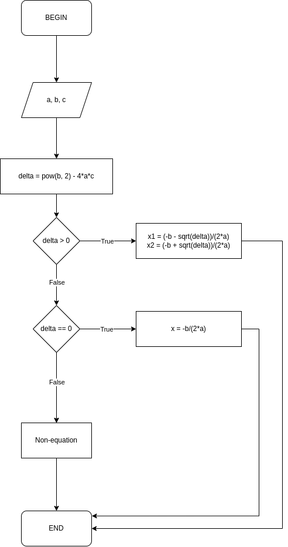

# Đặc tả thuật toán

Có nhiều cách đặc tả thuật toán

| Phương pháp     | Nội dung                                       |
|-----------------|------------------------------------------------|
| Không hình thức | Sử dụng ngôn ngữ tự nhiên để đặc tả thuật toán |
| Nửa hình thức   | Sử dụng lưu đồ để đặc tả thuật toán            |
| Hình thức       | Sử dụng mã giả để đặc tả thuật toán            |

## Không hình thức

Là phương pháp sử dụng ngôn ngữ tự nhiên để đặc tả thuật toán

**Ví dụ:**

Thuật toán tìm nghiệm của phương trình bậc 2 $ax^2 + bx + c = 0 (a \not ={0})$

Các bước thực hiện:

- Tính $\Delta = b^2 - 4ac$
  - TH1: $\Delta > 0$: Phương trình có hai nghiệm phân biệt:
    - $x_1 = {{- b + \sqrt{\Delta}\over{2a}}}$
    - $x_2 = {{- b - \sqrt{\Delta}\over{2a}}}$
  - TH2: $\Delta = 0$: Phương trình có nghiệm kép:
    - $x = {{-b}\over{2a}}$
  - TH3: $\Delta < 0$: Phương trình vô nghiệm

## Nửa hình thức

Là phương pháp sử dụng lưu đồ để đặc tả thuật toán

:::note

Có khá nhiều công cụ để vẽ lưu đồ thuật toán, một trong những cái phổ biến nhất là [draw.io](https://draw.io)

:::

**Ví dụ:**

Thuật toán tìm nghiệm của phương trình bậc 2 $ax^2 + bx + c = 0 (a \not ={0})$



## Hình thức

Sử dụng mã giả để đặc tả thuật toán

**Ví dụ:**

Thuật toán tìm nghiệm của phương trình bậc 2 $ax^2 + bx + c = 0 (a \not ={0})$

```py
delta = b^2 - 4 * a *c

if delta > 0:
  Phương trình có 2 nghiệm phân biệt
if delta == 0:
  Phương trình có nghiệm kép
if delta < 0:
  Phương trình vô nghiệm
```
